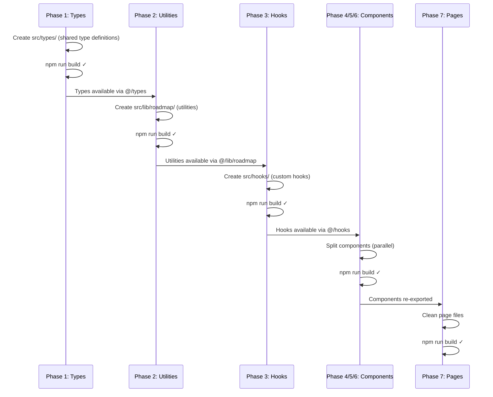
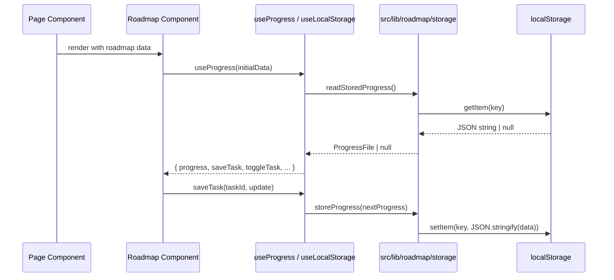

# Design Document: Project Restructure

## Overview

The cv-ngocnq skill roadmap feature has grown into 6 large component files (largest: 2,149 lines) with significant code duplication across types, utility functions, and localStorage logic. This restructuring extracts shared types into `src/types/`, utility functions into `src/lib/roadmap/`, stateful logic into `src/hooks/`, and splits monolithic components into focused sub-components (each ≤ 300 lines).

The refactoring is purely structural — no behavior changes. Each phase must pass `npm run build` before proceeding. The dependency chain is: Phase 1 → 2 → 3 → 4,5,6 (parallel) → 7.

## Architecture

```mermaid
graph TD
    subgraph "Current Architecture"
        SRC[SkillRoadmapClient.tsx<br/>2,149 lines]
        MCT[MarkdownCommentThreads.tsx<br/>~1,860 lines]
        STD[SkillRoadmapTaskDetail.tsx<br/>~813 lines]
        STF[SkillRoadmapTaskFlashcards.tsx<br/>~955 lines]
        STQ[SkillRoadmapTaskQuiz.tsx<br/>~1,136 lines]
        P1[tasks/taskId/page.tsx]
        P2[tasks/taskId/flashcards/page.tsx]
        P3[tasks/taskId/quiz/page.tsx]
    end

```mermaid
graph TD
    subgraph "Target Architecture"
        T[src/types/]
        L[src/lib/roadmap/]
        H[src/hooks/]
        
        subgraph "src/components/roadmap/"
            CC[client/]
            CM[comments/]
            CF[flashcards/]
            CQ[quiz/]
            CT[task-detail/]
        end
        
        CC --> H
        CM --> H
        CF --> H
        CQ --> H
        CT --> H
        H --> L
        H --> T
        L --> T
    end
```

## Sequence Diagrams

### Phase Dependency Flow



### Data Flow: localStorage State Management (After Refactor)



## Components and Interfaces

### Phase 1: Shared Types (`src/types/`)

**Purpose**: Single source of truth for all type definitions currently duplicated across 6+ files.

**Files**:
- `roadmap.ts` — Core roadmap data types
- `progress.ts` — Progress tracking types
- `comments.ts` — Note/comment types
- `flashcards.ts` — Flashcard types
- `quizzes.ts` — Quiz types
- `backup.ts` — Backup/export types
- `index.ts` — Barrel export

### Phase 2: Shared Utilities (`src/lib/roadmap/`)

**Purpose**: Extract ~600 lines of utility functions from SkillRoadmapClient plus duplicated helpers from page files.

**Files**:
- `constants.ts` — Storage keys, level styles, filter options
- `flatten-tasks.ts` — flattenTasks + getTaskContexts (deduplicated from 3 pages)
- `storage.ts` — All localStorage read/write/remove functions
- `normalize.ts` — All normalize* functions for data validation
- `filters.ts` — filterTaskTree, matchesTaskStudyStatus, collectTaskSearchText
- `prompts.ts` — buildLearningPrompt
- `backup.ts` — buildRoadmapBackup, normalizeRoadmapBackup
- `index.ts` — Barrel export

### Phase 3: Custom Hooks (`src/hooks/`)

**Purpose**: Encapsulate useState + useEffect patterns into reusable hooks, reducing component sizes by 30-50%.

**Files**:
- `useLocalStorage.ts` — Generic localStorage state sync
- `useProgress.ts` — Progress state, saveTask, toggleTask, sync logic
- `useNoteComments.ts` — Comments localStorage state
- `useFlashcardDecks.ts` — Flashcards localStorage state
- `useQuizDecks.ts` — Quizzes localStorage state
- `useGithubBackup.ts` — GitHub backup config + push logic
- `useRoadmapFilters.ts` — Filter/search/expand state
- `index.ts` — Barrel export

### Phase 4: Split SkillRoadmapClient (`src/components/roadmap/client/`)

**Purpose**: Split 2,149-line monolith into 6-7 focused components (each < 300 lines).

**Files**:
- `SkillRoadmapClient.tsx` — Composition root (~150 lines)
- `RoadmapHeroCard.tsx` — Stats/metrics display
- `RoadmapBackupPanel.tsx` — Import/export/GitHub backup UI
- `RoadmapFilterBar.tsx` — Search, level filter, status filter, expand/collapse
- `RoadmapTrackCard.tsx` — Track card with modules
- `TaskNode.tsx` — Individual task row (recursive)
- `Metric.tsx` — Reusable metric display component
- `index.ts` — Barrel export (re-exports SkillRoadmapClient)

### Phase 5: Split MarkdownCommentThreads (`src/components/roadmap/comments/`)

**Purpose**: Split ~1,860-line comment system into focused components.

**Files**:
- `MarkdownCommentThreads.tsx` — Composition root
- `CommentThread.tsx` — Thread view with tree rendering
- `CommentBubble.tsx` — Individual comment display
- `CommentForm.tsx` — Comment composer/editor
- `AiProviderSettings.tsx` — AI provider configuration
- `CommentSearchBar.tsx` — Search within comments
- `index.ts` — Barrel export

### Phase 6: Split TaskFlashcards, TaskQuiz, TaskDetail

**TaskFlashcards** (`src/components/roadmap/flashcards/`):
- `SkillRoadmapTaskFlashcards.tsx` — Composition root
- `FlashcardStudyPanel.tsx` — Card study UI
- `FlashcardFace.tsx` — Card face rendering
- `index.ts` — Barrel export

**TaskQuiz** (`src/components/roadmap/quiz/`):
- `SkillRoadmapTaskQuiz.tsx` — Composition root
- `QuizSessionPanel.tsx` — Active quiz UI
- `QuizResultPanel.tsx` — Results display
- `QuizHistoryPanel.tsx` — Past attempts
- `index.ts` — Barrel export

**TaskDetail** (`src/components/roadmap/task-detail/`):
- `SkillRoadmapTaskDetail.tsx` — Composition root
- `ChildTaskRow.tsx` — Child task display
- `TaskDetailInfo.tsx` — Detail metadata
- `index.ts` — Barrel export

### Phase 7: Page File Cleanup

**Purpose**: Remove duplicate `flattenTasks()` and `getTaskContexts()` from 3 page files.

**Change**: Import from `@/lib/roadmap/flatten-tasks` instead of local definitions.

## Data Models

### Core Types (`src/types/roadmap.ts`)

```typescript
export type RoadmapTask = {
  id: string;
  title: string;
  level: string;
  estimateHours: number;
  deliverable: string;
  children?: RoadmapTask[];
};

export type RoadmapModule = {
  id: string;
  title: string;
  tasks: RoadmapTask[];
};

export type RoadmapTrack = {
  id: string;
  title: string;
  level: string;
  duration: string;
  goal: string;
  skills: string[];
  modules: RoadmapModule[];
};

export type Roadmap = {
  meta: {
    owner: string;
    title: string;
    targetRole: string;
    durationWeeks: number;
    weeklyCommitment: string;
    reviewCadence: string;
  };
  tracks: RoadmapTrack[];
};

export type TaskContext = RoadmapTask & {
  trackTitle: string;
  moduleTitle: string;
  depth: number;
  parentTasks: Array<Pick<RoadmapTask, 'id' | 'title'>>;
};

export type TaskIndex = {
  taskById: Map<string, RoadmapTask>;
  ancestorIdsByTaskId: Map<string, string[]>;
};
```

### Progress Types (`src/types/progress.ts`)

```typescript
export type ProgressItem = {
  completed: boolean;
  note: string;
  completedAt: string | null;
  updatedAt: string;
};

export type ProgressFile = {
  updatedAt: string | null;
  items: Record<string, ProgressItem>;
};

export type StudyStatusFilter = 'all' | 'completed' | 'incomplete' | 'in-progress' | 'with-note';
```

### Comment Types (`src/types/comments.ts`)

```typescript
export type NoteComment = {
  id: string;
  parentId: string | null;
  author: 'user' | 'ai';
  body: string;
  createdAt: string;
  model?: string;
  provider?: string;
};

export type CommentNode = NoteComment & {
  children: CommentNode[];
};
```

### Flashcard Types (`src/types/flashcards.ts`)

```typescript
export type Flashcard = {
  id: string;
  front: string;
  back: string;
  hint: string;
  tag: string;
};

export type FlashcardDeck = {
  id: string;
  taskId: string;
  taskTitle: string;
  title: string;
  createdAt: string;
  source: { noteCharacters: number; commentCount: number };
  cards: Flashcard[];
};
```

### Quiz Types (`src/types/quizzes.ts`)

```typescript
export type QuizQuestion = {
  id: string;
  question: string;
  options: string[];
  correctOptionIndex: number;
  explanation: string;
  tag: string;
};

export type QuizAttempt = {
  id: string;
  startedAt: string;
  submittedAt: string | null;
  durationSeconds: number;
  answers: Record<string, number>;
  score: number | null;
  total: number;
  submittedBy: 'user' | 'timeout' | null;
};

export type QuizDeck = {
  id: string;
  taskId: string;
  taskTitle: string;
  title: string;
  durationMinutes: number;
  createdAt: string;
  source: { noteCharacters: number; commentCount: number };
  questions: QuizQuestion[];
  attempts: QuizAttempt[];
};
```

### Backup Types (`src/types/backup.ts`)

```typescript
import type { ProgressFile } from './progress';
import type { NoteComment } from './comments';
import type { FlashcardDeck } from './flashcards';
import type { QuizDeck } from './quizzes';

export type RoadmapBackupFile = {
  version: 4;
  exportedAt: string;
  progress: ProgressFile;
  comments: Record<string, NoteComment[]>;
  flashcards: Record<string, FlashcardDeck[]>;
  quizzes: Record<string, QuizDeck[]>;
};

export type GithubBackupConfig = {
  repoUrl: string;
  branch: string;
  backupPath: string;
  commitMessage: string;
  hasServerToken: boolean;
};
```

## Key Functions with Formal Specifications

### Function: flattenTasks()

```typescript
// src/lib/roadmap/flatten-tasks.ts
export function flattenTasks(tasks: RoadmapTask[]): RoadmapTask[];
export function flattenTasksWithContext(
  tasks: RoadmapTask[],
  trackTitle: string,
  moduleTitle: string,
  depth?: number,
  parentTasks?: Array<Pick<RoadmapTask, 'id' | 'title'>>
): TaskContext[];
export function getTaskContexts(tracks: RoadmapTrack[]): Map<string, TaskContext>;
```

**Preconditions:**
- `tasks` is a valid array (may be empty)
- Each task has a unique `id` within the tree
- `children` is either undefined or a valid array

**Postconditions:**
- Returns a flat array containing all tasks and nested children (DFS order)
- `result.length` equals total number of tasks in the tree
- Each task appears exactly once in the result
- Parent tasks appear before their children in the result
- No mutation of input data

**Loop Invariants:**
- For each recursive call: `depth` increases by 1
- `parentTasks` accumulates ancestor references correctly

### Function: normalizeProgress()

```typescript
// src/lib/roadmap/normalize.ts
export function normalizeProgress(input: unknown): ProgressFile | null;
export function normalizeCommentsByTask(input: unknown): Record<string, NoteComment[]> | null;
export function normalizeFlashcardsByTask(input: unknown): Record<string, FlashcardDeck[]> | null;
export function normalizeQuizzesByTask(input: unknown): Record<string, QuizDeck[]> | null;
export function normalizeRoadmapBackup(input: unknown): {
  progress: ProgressFile;
  comments: Record<string, NoteComment[]>;
  flashcards: Record<string, FlashcardDeck[]>;
  quizzes: Record<string, QuizDeck[]>;
} | null;
```

**Preconditions:**
- `input` is any unknown value (may be null, undefined, malformed)

**Postconditions:**
- Returns validated/normalized data if input is well-formed, null otherwise
- Never throws — all invalid data returns null
- Output types are guaranteed correct (no runtime type violations)
- No side effects

### Function: filterTaskTree()

```typescript
// src/lib/roadmap/filters.ts
export function filterTaskTree(
  tasks: RoadmapTask[],
  predicate: (task: RoadmapTask) => boolean
): RoadmapTask[];
export function matchesTaskStudyStatus(
  task: RoadmapTask,
  progress: ProgressFile,
  filter: StudyStatusFilter
): boolean;
export function collectTaskSearchText(
  task: RoadmapTask,
  moduleTitle: string,
  trackTitle: string,
  skills: string[]
): string;
```

**Preconditions:**
- `tasks` is a valid array
- `predicate` is a pure function (no side effects)
- `progress` is a valid ProgressFile

**Postconditions:**
- `filterTaskTree` returns a subset of the tree preserving parent-child structure
- A parent is included if it matches OR if any descendant matches
- Original tree structure is not mutated (new objects returned)
- `matchesTaskStudyStatus` returns boolean without side effects

**Loop Invariants:**
- Tree structure is preserved: if a child is included, all its ancestors are included

### Function: useProgress() Hook

```typescript
// src/hooks/useProgress.ts
export function useProgress(initialProgress?: ProgressFile): {
  progress: ProgressFile;
  saveTask: (taskId: string, update: Partial<ProgressItem>) => Promise<void>;
  toggleTask: (task: RoadmapTask) => void;
  updateNote: (taskId: string, note: string) => void;
  resetProgress: () => void;
  savingTaskId: string | null;
  loadError: string | null;
};
```

**Preconditions:**
- Called within a React component (hooks rules)
- localStorage is available in the browser environment

**Postconditions:**
- `progress` always contains valid ProgressFile state
- `saveTask` persists to localStorage and optionally syncs to API
- Optimistic updates are applied immediately
- On API failure, localStorage state is preserved with error message

### Function: useLocalStorage() Hook

```typescript
// src/hooks/useLocalStorage.ts
export function useLocalStorage<T>(
  key: string,
  initialValue: T,
  options?: {
    serialize?: (value: T) => string;
    deserialize?: (raw: string) => T | null;
  }
): [T, (value: T | ((prev: T) => T)) => void, () => void];
```

**Preconditions:**
- `key` is a non-empty string
- `initialValue` is a valid default value
- Called within a React component

**Postconditions:**
- Returns tuple: [currentValue, setter, remover]
- Setter persists to localStorage synchronously
- Getter reads from localStorage on mount
- Remover clears the key from localStorage
- Invalid stored data falls back to initialValue

## Algorithmic Pseudocode

### Task Tree Flattening Algorithm

```typescript
function flattenTasksWithContext(
  tasks: RoadmapTask[],
  trackTitle: string,
  moduleTitle: string,
  depth = 0,
  parentTasks: Array<Pick<RoadmapTask, 'id' | 'title'>> = []
): TaskContext[] {
  // ASSERT: tasks is valid array
  // ASSERT: depth >= 0
  // INVARIANT: parentTasks.length === depth

  return tasks.flatMap((task) => {
    const current: TaskContext = {
      ...task,
      trackTitle,
      moduleTitle,
      depth,
      parentTasks,
    };

    const children = flattenTasksWithContext(
      task.children ?? [],
      trackTitle,
      moduleTitle,
      depth + 1,
      [...parentTasks, { id: task.id, title: task.title }]
    );

    return [current, ...children];
  });

  // POST: result contains every task exactly once
  // POST: DFS ordering preserved (parent before children)
}
```

### Filter Task Tree Algorithm

```typescript
function filterTaskTree(
  tasks: RoadmapTask[],
  predicate: (task: RoadmapTask) => boolean
): RoadmapTask[] {
  // ASSERT: predicate is pure (no side effects)
  // INVARIANT: tree structure is preserved for included nodes

  return tasks
    .map((task) => {
      const filteredChildren = filterTaskTree(task.children ?? [], predicate);
      const selfMatches = predicate(task);
      const hasMatchingDescendants = filteredChildren.length > 0;

      if (!selfMatches && !hasMatchingDescendants) {
        return null;
      }

      return {
        ...task,
        children: filteredChildren.length > 0 ? filteredChildren : task.children,
      };
    })
    .filter((task): task is RoadmapTask => task !== null);

  // POST: every leaf in result matches predicate OR has a descendant that matches
  // POST: original tasks array is not mutated
}
```

### Progress Update Algorithm (Optimistic)

```typescript
function applyTaskProgressUpdate(
  progress: ProgressFile,
  taskId: string,
  update: Partial<ProgressItem>,
  taskIndex: TaskIndex
): ProgressFile {
  // ASSERT: taskId exists in taskIndex
  // ASSERT: progress is valid ProgressFile

  const now = new Date().toISOString();
  const currentItem = progress.items[taskId];
  const nextItem: ProgressItem = {
    completed: update.completed ?? currentItem?.completed ?? false,
    note: update.note ?? currentItem?.note ?? '',
    completedAt: update.completedAt ?? currentItem?.completedAt ?? null,
    updatedAt: now,
  };

  const nextItems = { ...progress.items, [taskId]: nextItem };

  // Propagate to ancestors if completing
  if (nextItem.completed) {
    const ancestorIds = taskIndex.ancestorIdsByTaskId.get(taskId) ?? [];
    // Mark ancestors as in-progress if they have incomplete children
  }

  return { updatedAt: now, items: nextItems };

  // POST: progress.items[taskId] reflects the update
  // POST: progress.updatedAt is current timestamp
  // POST: original progress object is not mutated
}
```

## Example Usage

### After Refactor: Page File (Phase 7)

```typescript
// src/app/skill-roadmap/tasks/[taskId]/page.tsx
import { notFound } from 'next/navigation';
import { SkillRoadmapTaskDetail } from '@/components/roadmap/task-detail';
import { Container } from '@/components/ui';
import { getTaskContexts } from '@/lib/roadmap/flatten-tasks';

export default async function SkillRoadmapTaskDetailPage({
  params,
}: {
  params: Promise<{ taskId: string }>;
}) {
  const { taskId } = await params;
  const task = getTaskContexts().get(decodeURIComponent(taskId));

  if (!task) notFound();

  return (
    <Container size="lg" className="py-10 md:py-12">
      <SkillRoadmapTaskDetail task={task} />
    </Container>
  );
}
```

### After Refactor: SkillRoadmapClient Composition Root (Phase 4)

```typescript
// src/components/roadmap/client/SkillRoadmapClient.tsx
'use client';

import type { Roadmap } from '@/types';
import { useProgress } from '@/hooks/useProgress';
import { useRoadmapFilters } from '@/hooks/useRoadmapFilters';
import { useGithubBackup } from '@/hooks/useGithubBackup';
import { RoadmapHeroCard } from './RoadmapHeroCard';
import { RoadmapBackupPanel } from './RoadmapBackupPanel';
import { RoadmapFilterBar } from './RoadmapFilterBar';
import { RoadmapTrackCard } from './RoadmapTrackCard';

interface SkillRoadmapClientProps {
  roadmap: Roadmap;
}

export function SkillRoadmapClient({ roadmap }: SkillRoadmapClientProps) {
  const { progress, saveTask, toggleTask, updateNote, savingTaskId, loadError } =
    useProgress();
  const { filteredTracks, query, setQuery, levelFilter, setLevelFilter, ... } =
    useRoadmapFilters(roadmap, progress);
  const backup = useGithubBackup(progress);

  return (
    <div className="space-y-6">
      <RoadmapHeroCard progress={progress} roadmap={roadmap} />
      <RoadmapBackupPanel {...backup} progress={progress} />
      <RoadmapFilterBar ... />
      {filteredTracks.map((track) => (
        <RoadmapTrackCard key={track.id} track={track} ... />
      ))}
    </div>
  );
}
```

### After Refactor: Custom Hook Usage (Phase 3)

```typescript
// src/hooks/useProgress.ts
import { useState, useEffect, useMemo } from 'react';
import type { ProgressFile, ProgressItem, RoadmapTask, TaskIndex } from '@/types';
import {
  readStoredProgress,
  storeProgress,
  removeStoredProgress,
} from '@/lib/roadmap/storage';
import { applyTaskProgressUpdate, buildTaskIndex } from '@/lib/roadmap/filters';

export function useProgress() {
  const [progress, setProgress] = useState<ProgressFile>(emptyProgress);
  const [savingTaskId, setSavingTaskId] = useState<string | null>(null);
  const [loadError, setLoadError] = useState<string | null>(null);

  useEffect(() => {
    // Load from localStorage + seed from API
    const stored = readStoredProgress();
    if (stored) setProgress(stored);
    // ... fetch seed and merge
  }, []);

  async function saveTask(taskId: string, update: Partial<ProgressItem>) {
    // Optimistic update + API sync
  }

  function toggleTask(task: RoadmapTask) {
    // Toggle completion state
  }

  return { progress, saveTask, toggleTask, savingTaskId, loadError, ... };
}
```

## Correctness Properties

*A property is a characteristic or behavior that should hold true across all valid executions of a system — essentially, a formal statement about what the system should do. Properties serve as the bridge between human-readable specifications and machine-verifiable correctness guarantees.*

### Property 1: Barrel Export Completeness

*For any* public symbol defined in a module within a barrel-exported directory (`src/types/`, `src/lib/roadmap/`, `src/hooks/`, or any `src/components/roadmap/*` subdirectory), that symbol SHALL be re-exported through the directory's `index.ts` barrel file.

**Validates: Requirements 2.2, 3.2, 4.2, 5.2, 6.2, 7.2, 11.2**

### Property 2: File Size Constraint

*For any* file created or modified by the refactoring, the total number of lines SHALL be 300 or fewer.

**Validates: Requirements 5.3, 6.3, 7.3, 9.1, 9.2**

### Property 3: Export API Compatibility

*For any* original named export (`SkillRoadmapClient`, `SkillRoadmapTaskDetail`, `SkillRoadmapTaskFlashcards`, `SkillRoadmapTaskQuiz`, `MarkdownCommentThreads`), that export SHALL remain importable from its barrel re-export path after the refactoring.

**Validates: Requirements 10.3, 11.3**

### Property 4: Normalize Valid Input Preservation

*For any* valid input object conforming to the expected schema (ProgressFile, NoteComment[], FlashcardDeck[], QuizDeck[]), the corresponding normalize function SHALL return a correctly typed object equivalent to the input.

**Validates: Requirements 14.1, 14.3**

### Property 5: Normalize Invalid Input Safety

*For any* invalid input (null, undefined, malformed objects, random values), all normalize functions SHALL return null without throwing an exception.

**Validates: Requirements 14.2**

### Property 6: flattenTasks Node Count Invariant

*For any* valid task tree, `flattenTasks(tree).length` SHALL equal the total number of nodes in the tree (each task appears exactly once in the result).

**Validates: Requirements 15.1, 15.3**

### Property 7: flattenTasks DFS Ordering

*For any* valid task tree, in the flattened result every parent task SHALL appear at an index strictly less than any of its children's indices (depth-first pre-order).

**Validates: Requirements 15.2**

### Property 8: Tree Operation Immutability

*For any* valid task tree, calling `flattenTasks` or `filterTaskTree` SHALL not mutate the input tree (the tree is structurally identical before and after the call).

**Validates: Requirements 15.4, 16.3**

### Property 9: filterTaskTree Ancestor Preservation

*For any* valid task tree and predicate, if a descendant node appears in the filtered result, all of its ancestor nodes SHALL also appear in the result.

**Validates: Requirements 16.1**

### Property 10: filterTaskTree Identity

*For any* valid task tree, applying `filterTaskTree` with a predicate that always returns true SHALL produce a tree structurally equivalent to the input.

**Validates: Requirements 16.4**

### Property 11: filterTaskTree Empty Predicate

*For any* valid task tree, applying `filterTaskTree` with a predicate that always returns false SHALL produce an empty array.

**Validates: Requirements 16.2**

## Error Handling

### Phase Build Failure

**Condition**: `npm run build` fails after a phase change
**Response**: Revert the phase changes and fix before proceeding
**Recovery**: Each phase is atomic — either fully applied or fully reverted

### Import Resolution Failure

**Condition**: TypeScript cannot resolve `@/types`, `@/lib/roadmap`, or `@/hooks`
**Response**: Verify `tsconfig.json` paths configuration includes new directories
**Recovery**: Add path mappings if needed (Next.js `@/` alias typically covers all `src/` subdirectories)

### Circular Dependency

**Condition**: New module structure introduces circular imports
**Response**: Move shared code to a lower-level module
**Recovery**: The layered architecture (types → lib → hooks → components) prevents cycles by design

## Testing Strategy

### Unit Testing Approach

Since this is a structural refactor with no behavior changes, the primary verification is:
- `npm run build` passes after each phase
- `npm run typecheck` passes (TypeScript strict mode)
- `npm run lint` passes

Future unit tests (enabled by this refactor):
- `src/lib/roadmap/normalize.ts` — Pure functions with clear input/output contracts
- `src/lib/roadmap/flatten-tasks.ts` — Tree traversal correctness
- `src/lib/roadmap/filters.ts` — Filter predicate combinations
- `src/hooks/*.ts` — Hook behavior with React Testing Library

### Property-Based Testing Approach

**Property Test Library**: fast-check (recommended for TypeScript/Next.js)

Key properties that become testable after extraction:
- `flattenTasks(tree).length === countAllNodes(tree)` for any valid tree
- `normalizeProgress(serialize(progress)) ≡ progress` for any valid ProgressFile
- `filterTaskTree(tasks, () => true) ≡ tasks` (identity filter)
- `filterTaskTree(tasks, () => false) ≡ []` (empty filter)

### Integration Testing Approach

- Verify barrel exports resolve correctly: import from `@/types`, `@/lib/roadmap`, `@/hooks`
- Verify component composition: SkillRoadmapClient renders without errors with mock roadmap data
- Verify page routes still work: dynamic routes resolve task IDs correctly

## Performance Considerations

- **Bundle size**: No change expected — same code, just reorganized
- **Tree shaking**: Improved — barrel exports enable better dead code elimination
- **Code splitting**: Each page only imports what it needs via specific hook/utility imports
- **Runtime**: No performance impact — pure structural refactor

## Security Considerations

- No security changes — localStorage access patterns remain identical
- API calls remain the same
- No new external dependencies introduced

## Dependencies

No new dependencies required. The refactoring uses only existing project capabilities:
- TypeScript path aliases (`@/` → `src/`)
- Next.js `'use client'` directive for client components
- React hooks API (useState, useEffect, useMemo, useCallback)
- Existing UI components from `@/components/ui`
